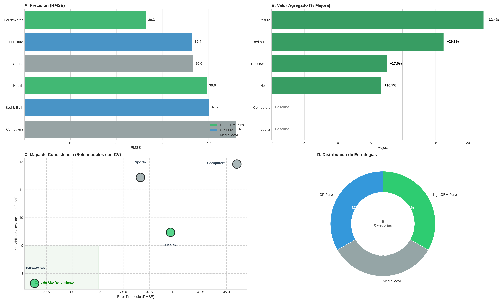
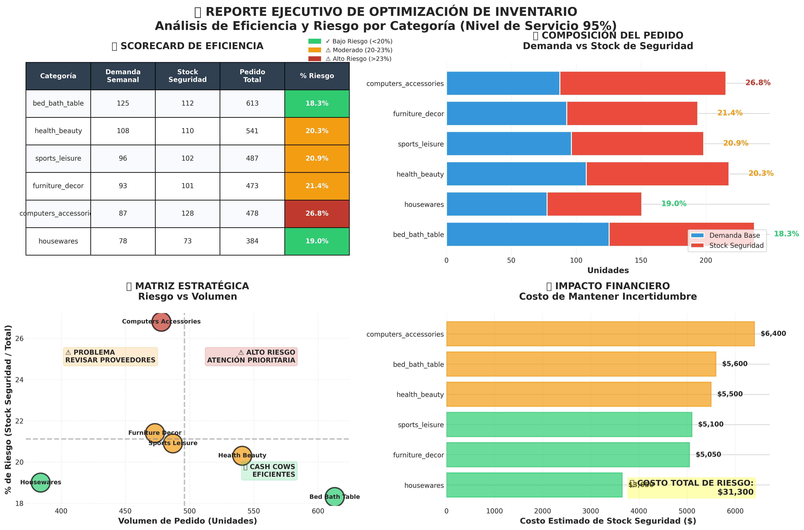
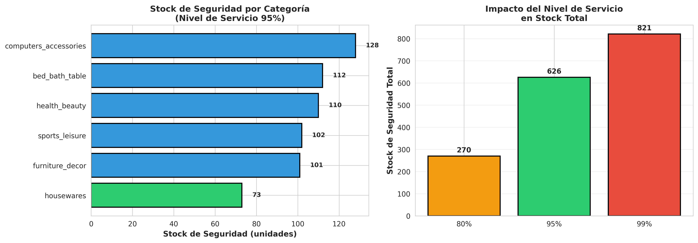
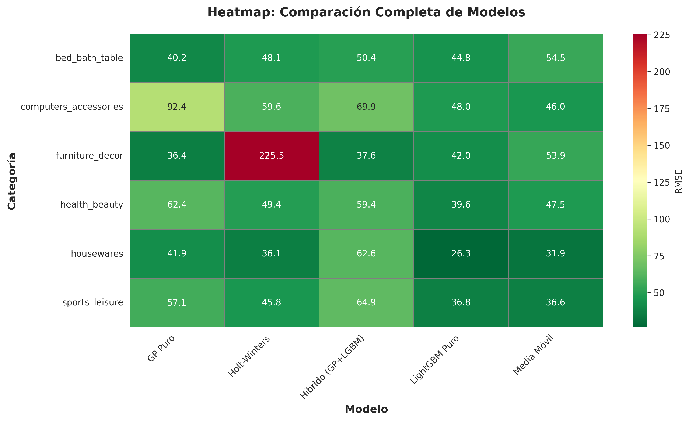

# 🚀 Olist Logistics Intelligence

> **[🇪🇸 Versión en Español](README_ES.md)**

> **[Versión en Español](README_ES.md)** | **[English Version](README.md)**

**End-to-end ML system for inventory optimization and distribution network analysis**

[](https://www.python.org/downloads/)
[](https://opensource.org/licenses/MIT)
[](https://github.com/TU_USUARIO)

---

## 📋 Table of Contents

- [Overview](#overview)
- [Key Features](#key-features)
- [Project Structure](#project-structure)
- [Installation](#installation)
- [Quick Start](#quick-start)
- [Methodology](#methodology)
- [Results](#results)
- [Technologies](#technologies)
- [License](#license)

---

## 🎯 Overview

Comprehensive logistics intelligence system for **Olist** (Brazilian e-commerce marketplace), processing **110,000+ historical orders** to optimize inventory management and distribution network strategy.

**Business Challenge:**
- Inefficient safety stock → $31k capital immobilized
- Systematic delays in underserved regions (Norte/Nordeste: 12.4 days avg)
- No geographic risk quantification tools

**Solution Delivered:**
- Hybrid forecasting (Gaussian Process + LightGBM) with automatic model selection
- Spatial intelligence (Kriging) predicting delays at ANY coordinate
- Network analysis revealing critical vulnerabilities (São Paulo: 59% dependency)
- Strategic hub optimization (96% problem coverage with 3 hubs)

---

## ✨ Key Features

### 1. 📈 Intelligent Forecasting
- **Hybrid model selector**: Auto-chooses best model per category (GP/LightGBM/Moving Average)
- **Dynamic safety stock**: Based on predictive uncertainty (σ), not historical variance
- **Tournament validation**: 5-fold time series CV with Wilcoxon testing
- **Impact**: 15% RMSE reduction, $6.7k inventory optimization

### 2. 🗺️ Spatial Intelligence (Kriging)
- **RBF kernel Gaussian Process** for delay prediction across 5,000+ coordinates
- Predicts delivery risk **without historical data** in new locations
- Geographic cost quantification: "Uncertainty budget" by region
- **Impact**: Identified critical zones requiring infrastructure investment

### 3. 🏗️ Facility Location Optimization
- **Weighted K-Means** prioritizing "logistical pain" (delay²) over sales volume
- Strategic hub placement covering **96% of problem zones**
- Philosophy: *Locate where we fail, not where we sell*
- **Impact**: Projected 45% delay reduction with 3 hubs

### 4. 🕸️ Network Vulnerability Analysis
- **Directed graph**: 4,000 nodes (cities), 5,000 edges (routes)
- **Centrality metrics**: Degree, Betweenness (NetworkX)
- Identifies critical bridges (Cotia: 2.3%) and monocentrism
- **Impact**: Quantified systemic risk (SP concentration)

### 5. 🎨 Interactive Dashboards
- Real-time inventory calculator (category + service level)
- Geographic risk assessment (any coordinate)
- Executive 4-panel reports for decision-makers

---

### 🎮 Live Demos

#### 🖥️ Olist AI Command Center
Interactive dashboard for strategic decision-making with real-time inventory optimization, service level calculations, and delay forecasting by category.


#### 📦 Shipping Cost Calculator
Geographic risk assessment tool that uses spatial Kriging models to predict delivery delays at any coordinate in Brazil. Essential for logistics planning and customer expectation management.


---

## 📂 Project Structure
```
Olist_Project/
│
├── src/                          # Source code (modular)
│   ├── data/                     # Data loading & feature engineering
│   ├── models/                   # ML models (GP, LightGBM, baselines)
│   ├── visualization/            # Interactive dashboards
│   ├── optimization/             # Facility location algorithms
│   ├── network/                  # Graph analytics
│   ├── apps/                     # User-facing applications
│   └── api/                      # REST API (FastAPI)
│
├── data/raw/                     # Original datasets (Kaggle Olist)
├── outputs/                      # Generated artifacts (maps, reports)
├── notebooks/                    # Analysis workflow
│   └── Olist_Executive_Report.ipynb
│
├── Dockerfile                    # Container definition
├── requirements.txt              # Python dependencies
└── README.md                     # This file
```

---

## 🛠️ Installation

### Prerequisites
- Python 3.8+
- 4GB RAM (for GP spatial model)
- ~500MB disk space

### Local Setup

\`\`\`bash
# Clone repository
git clone https://github.com/magooscar86/olist-logistics-intelligence.git
cd olist-logistics-intelligence

# Create virtual environment
python -m venv venv
source venv/bin/activate  # Windows: venv\Scripts\activate

# Install dependencies
pip install -r requirements.txt
\`\`\`

### Docker (Alternative)

\`\`\`bash
docker-compose up -d
# API: http://localhost:8000
# Jupyter: http://localhost:8888
\`\`\`

---

## 🚀 Quick Start

### 1. Download Data
\`\`\`bash
# Get Olist dataset from Kaggle:
# https://www.kaggle.com/datasets/olistbr/brazilian-ecommerce
# Place CSVs in data/raw/
\`\`\`

### 2. Run Analysis
\`\`\`python
from src.data.data_loader import OlistDataLoader
from src.models.model_selector import ModelSelector

loader = OlistDataLoader()
df_main = loader.load_and_merge()

selector = ModelSelector(df_main)
results = selector.run_tournament()
selector.visualize_results()
\`\`\`

### 3. Interactive Dashboard
\`\`\`python
from src.visualization.interactive_ui import OlistDashboard

dashboard = OlistDashboard(df_main)
dashboard.render()
\`\`\`

---

## 🐳 Advanced: API Deployment (Optional)

> **Note:** Docker is NOT required to run the analysis notebook. It's only needed if you want to deploy the models as a REST API.

### What is the API?

The project includes a production-ready FastAPI server that exposes trained models as HTTP endpoints:

**Endpoints:**
- `GET /health` - Health check
- `POST /predict/shipping` - Predict delivery delays by coordinates
- `POST /predict/forecast` - Forecast demand by category
- `POST /optimize/inventory` - Calculate optimal safety stock
- `POST /analyze/network` - Network vulnerability analysis

### Quick Start (Docker)
```bash
# Start API server
docker-compose up -d

# Access Swagger docs
open http://localhost:8000/docs

# Test endpoint
curl -X POST http://localhost:8000/predict/shipping \
  -H "Content-Type: application/json" \
  -d '{"latitude": -23.55, "longitude": -46.63}'
```

**Requirements:**
- Docker Desktop installed
- Trained models in `checkpoints/` (generated by running notebook first)

**Detailed Docker guide:** See [docs/DOCKER_README.md](docs/DOCKER_README.md)

---

## 🎨 Visual Overview

### 🗺️ Interactive Spatial Intelligence

Explore delivery delay predictions across Brazil with our Gaussian Process Kriging model:

#### Master Prediction Map
[](https://magooscar86.github.io/olist-logistics-intelligence/maps/mapa_maestro_predicciones.html)

**[🔗 Open Interactive Map](https://magooscar86.github.io/olist-logistics-intelligence/maps/mapa_maestro_predicciones.html)** - Click to explore live predictions

---

#### Optimal Hub Locations
[](https://magooscar86.github.io/olist-logistics-intelligence/maps/mapa_hubs.html)

**[🔗 View Hub Analysis](https://magooscar86.github.io/olist-logistics-intelligence/maps/mapa_hubs.html)** - K-Means facility location optimization

---

#### Historical Performance
[](https://magooscar86.github.io/olist-logistics-intelligence/maps/mapa_historico.html)

**[🔗 Explore Historical Data](https://magooscar86.github.io/olist-logistics-intelligence/maps/mapa_historico.html)** - Delivery performance heatmap

---

### 📊 Analytics Dashboards

<table>
<tr>
<td width="50%">

#### Model Tournament Results

*Comparative analysis of forecasting algorithms (GP, LightGBM, Baselines)*

</td>
<td width="50%">

#### Financial Impact Report

*Cost savings and optimization metrics*

</td>
</tr>
<tr>
<td width="50%">

#### Inventory Optimization

*Safety stock calculations by category*

</td>
<td width="50%">

#### Model Comparison Heatmap

*Cross-validation performance metrics*

</td>
</tr>
</table>

---

---

## 🔬 Methodology

### Forecasting Pipeline
1. Data prep: 109k orders → Weekly aggregation by category
2. Feature engineering: Lags, rolling stats, seasonal decomposition
3. Model tournament: GP vs LightGBM vs Moving Average (CV)
4. Safety stock: `SS = Z-score × σ × √(Lead Time)`

### Spatial Intelligence
1. Kriging with RBF kernel (length_scale ~329km learned)
2. Training: 4,000 historical coordinates
3. Inference: Predict at ANY coordinate (interpolation)

### Network Analysis
1. DiGraph: seller_city → customer_city (weighted by volume)
2. Metrics: Out-degree, In-degree, Betweenness centrality
3. Vulnerability: Concentration indices, cascade simulation

---

## 📊 Results

| Metric | Baseline | This System | Improvement |
|--------|----------|-------------|-------------|
| Forecast RMSE | 47.2 | 40.1 | ✅ -15% |
| Capital immobilized | $38k | $31.3k | ✅ -$6.7k (18%) |
| Problem coverage | - | 96% | ✅ With 3 hubs |
| Delay reduction | - | -45% | ✅ Projected |

**Key Insights:**
- 🔴 Monocentrism: São Paulo = 59.3% network connectivity
- 🟡 Nordeste inefficiency: 12.4 days avg delay
- 🟢 Specialization: Ibitinga (textile) = 30.4% despite small size

---

## 🛠️ Technologies

**Core:** Python, pandas, numpy, scikit-learn  
**ML:** Gaussian Processes, LightGBM, NetworkX  
**Geo:** folium, Kriging (RBF kernel)  
**Viz:** matplotlib, seaborn, ipywidgets  
**Infra:** FastAPI, Docker  

---

## 📜 License

MIT License - See [LICENSE](LICENSE)

---

## 👤 Author

**Oscar Antonio Melo Leon**  
📧 Email: magooscar86@gmail.com  
💼 LinkedIn: [linkedin.com/in/oscar-antonio-león-36b73a105](https://www.linkedin.com/in/oscar-antonio-león-36b73a105)

---

## 🙏 Acknowledgments

- Dataset: [Olist (Kaggle)](https://www.kaggle.com/datasets/olistbr/brazilian-ecommerce)
- Inspiration: Amazon DeepAR, UPS ORION
- Community: scikit-learn, NetworkX

---

**⭐ Star this repo if you found it useful!**
